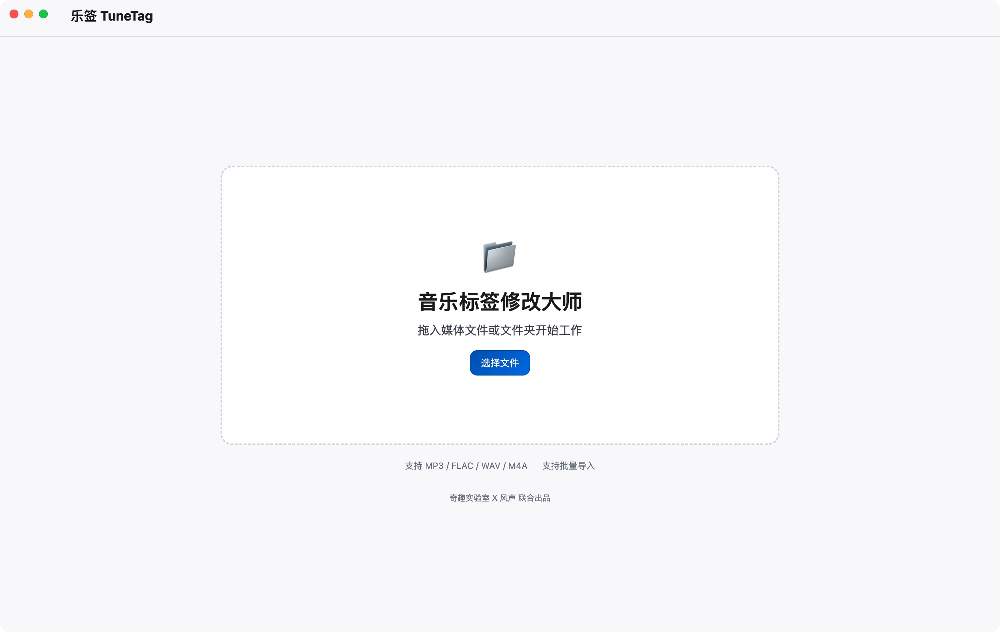
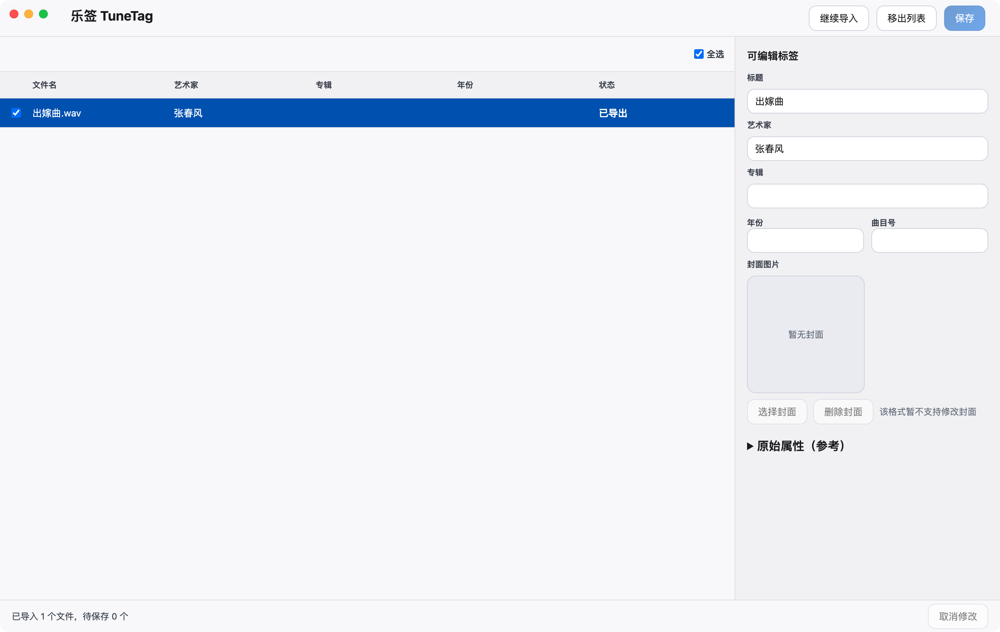

# 乐签 TuneTag

TuneTag 是一款面向 macOS 的本地媒体标签编辑工具，聚焦一件事：

**把一批音频文件拖进来，然后快速修改标签信息。**

> 当前仓库主开发目录：`tunetag-web`（Electron + React + TypeScript）

## 下载与运行

当前仓库提供源码，建议本地打包后运行：

```bash
cd tunetag-web
npm install
npm run build
npx @electron/packager . TuneTag \
  --platform=darwin \
  --arch=arm64 \
  --overwrite \
  --icon=electron/assets/app-icon.icns \
  --out=release \
  --app-bundle-id=com.citoma.tunetag
open release/TuneTag-darwin-arm64/TuneTag.app
```

## 界面预览

### Logo


### 空状态



### 主工作区



## 产品定位

- 轻量本地工具，不是媒体库管理器
- 以批量标签编辑为核心，不做播放能力
- 面向中文场景，强调直接、清晰、可控

## 当前已实现能力（V1）

- 极简导入入口：支持拖拽文件、批量文件、文件夹；自动递归读取并过滤支持格式
- 主工作区围绕列表：单选 / 多选 / 全选、状态可视化（未修改 / 已修改 / 已导出 / 保存失败）
- 单文件标签编辑（可写字段）：
  - 标题（TIT2）、艺术家（TPE1）、专辑（TALB）、年份（TYER/TDRC）、曲目号（TRCK）
  - 流派（TCON）、歌词（USLT）、备注（COMM）、自定义（WOAS）
  - 封面（APIC）：显示已有内嵌封面，支持替换与删除留空
- 批量编辑模式：
  - 标题、艺术家留空：保持不修改
  - 其他字段留空：按空值写入（用于批量清空）
  - 历史输入快速选择：常用值一键回填，并支持逐条删除历史
- 保存流程（面向生产使用）：
  - 选择目标文件夹后统一写入，展示实时进度与成功/失败统计
  - 同名文件冲突明确弹窗：覆盖 / 保留两者 / 跳过
  - 失败文件提供具体原因，便于重试与定位
- 多格式标签写入与中文处理增强：
  - MP3 / FLAC / M4A / WAV 均可写基础标签
  - 对中文与长文本（尤其歌词）做了读取/写入兼容处理，降低乱码风险
- 外部链接统一走系统浏览器打开（不使用内置浏览页面）

## 支持格式

- `MP3`
- `FLAC`
- `WAV`
- `M4A`

## 技术栈

- Electron
- React 19
- TypeScript
- Vite
- ffmpeg / ffprobe
- music-metadata
- node-id3

## 核心交互闭环

`拖入文件 -> 列表展示 -> 单选/多选 -> 编辑标签 -> 保存写入`

## 本地开发

### 1. 安装依赖

```bash
cd tunetag-web
npm install
```

### 2. 启动开发环境

```bash
npm run dev
```

会同时启动：

- Vite 开发服务（`5173`）
- Electron 桌面应用

### 3. 构建前端

```bash
npm run build
```

## 打包 macOS App

在 `tunetag-web` 目录执行：

```bash
npx @electron/packager . TuneTag \
  --platform=darwin \
  --arch=arm64 \
  --overwrite \
  --icon=electron/assets/app-icon.icns \
  --out=release \
  --app-bundle-id=com.citoma.tunetag
```

产物默认在：

`tunetag-web/release/TuneTag-darwin-arm64/TuneTag.app`

## 常见问题（FAQ）

### 1) 为什么打包后页面空白？

- 请确认 `vite.config.ts` 中 `base` 为 `./`
- 重新执行 `npm run build` 后再打包

### 2) 同名文件保存时会怎样？

- 会弹出冲突处理对话框：`覆盖 / 保留两者 / 跳过`

### 3) 批量编辑留空规则是什么？

- 标题、艺术家留空：不修改
- 其他字段留空：清空写入

## 项目结构

```text
TuneTag/
├── tunetag-web/             # 主应用（Electron + React）
│   ├── electron/            # 主进程、预加载、桌面能力
│   ├── src/                 # 前端 UI 与交互逻辑
│   ├── public/              # 静态资源
│   └── release/             # 本地打包产物（已忽略）
├── TuneTagMac/              # 早期原生尝试/预研目录
├── design/                  # 设计稿与素材
├── docs/                    # 设计与文档
└── prototype/               # 原型实验
```

## 版权与开源协议

- Copyright (c) 2026 TuneTag Contributors
- 本项目采用 **MIT License**，属于完全开源协议，可用于个人与商业场景。
- 你可以自由使用、修改、分发与二次开发，但需保留原始版权与许可声明。

详见仓库根目录的 [LICENSE](LICENSE) 文件。
